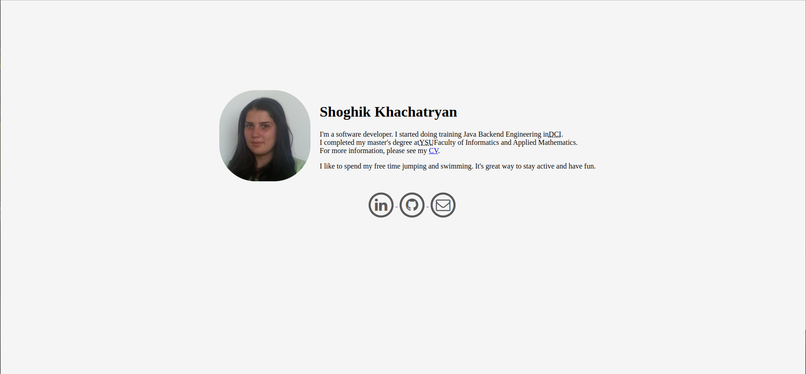

### AboutMe - personal web page
A simple web page to present myself.

#### Table of contents
* [Technologies](#technologies)
* [Usage](#usage)

#### Technologies
Project is created with:
* html
* css

#### Usage
In URL write  
https://shoghikkhachatryan.github.io/AboutMe/  
or in lockal  
1. Clone this repository:   
`git clone https://github.com/ShoghikKhachatryan/AboutMe.git`
2. Navigate to the project directory:
 `cd AboutMe`
3. Open **_`index.html`_** in your web browser.
